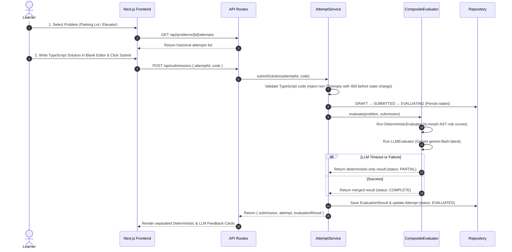

# Design Note — LLD Practice Platform MVP

## 1. MVP Scope & User Flow

### MVP Scope
The **LLD Practice Platform** provides a structured, repeatable feedback loop specifically for Object-Oriented Low-Level Design (LLD). Learners pick a problem, write TypeScript code in a blank editor, submit it for evaluation, and receive structured deterministic and LLM-powered feedback.

- **Seeded Problems**: Exactly 2 problem domains: **Parking Lot System** and **Elevator Control System**.
- **Supported Submission Language**: TypeScript plain text (`.ts`).
- **Evaluation Mechanism**: Pluggable `EvaluationStrategy` combining deterministic AST structural checks (`ts-morph`) and Object-Oriented design rubric review (Google Gemini `gemini-flash-latest`).
- **Persistence**: Swappable `Repository` abstraction defaulted to `InMemoryRepository`.

### User Flow


---

## 2. Key Domain Model & Architecture

### Domain Classes & Interfaces
- **`Problem`**: Represents an LLD exercise with specifications and requirements.
- **`Attempt`**: Manages attempt lifecycle state (`DRAFT` → `SUBMITTED` → `EVALUATING` → `EVALUATED` | `FAILED`).
- **`Submission`**: Captures raw TypeScript solution code tied to an attempt.
- **`EvaluationResult` & `Feedback`**: Structured output holding deterministic continuous rule scores and LLM rubric design evaluations.
- **`EvaluationStrategy`**: Pluggable interface (`evaluate(problem, submission)`) implemented by:
  - `DeterministicEvaluator`: AST parsing via `ts-morph` exposing transparent per-rule scores and `RULE_WEIGHTS`.
  - `LLMEvaluator`: Structured JSON evaluation via Gemini API (`gemini-flash-latest`).
  - `CompositeEvaluator`: Orchestrates both evaluators with fallback logic.
- **`Repository`**: Storage contract decoupling business logic from underlying persistence engines.
- **`AttemptService`**: Application service layer handling workflow orchestration, pre-submission validation, and state machine transitions.

---

## 3. Pluggable Evaluation Approach

The evaluation system separates structural code facts from qualitative design reviews:

```
                          CompositeEvaluator
                                  │
                 ┌────────────────┴────────────────┐
                 ▼                                 ▼
      DeterministicEvaluator                  LLMEvaluator
          (ts-morph AST)                  (gemini-flash-latest)
                 │                                 │
  ├── Class Count (20%)             ├── SRP Adherence (1-5)
  ├── God-Class Antipattern (20%)   ├── Coupling (1-5)
  ├── Encapsulation (20%)           ├── Extensibility (1-5)
  ├── Interface Usage (25%)         ├── Relationships (1-5)
  └── Naming Conventions (15%)      └── Naming Quality (1-5)
```

- **Deterministic Score Breakdown**: `DeterministicEvaluator` preserves the continuous 0–100 score per rule in `DeterministicRuleFeedback.score`. `FeedbackView` computes earned points per rule (`Math.round(rule.score * RULE_WEIGHTS[rule.category])`), which arithmetically sum to `DeterministicEvaluationResult.score`.
- **Model Stability**: `LLMEvaluator` uses a single constant rolling alias `gemini-flash-latest` configured in one place to ensure continuous compatibility with Google Gemini API without dated model deprecation issues.
- **Fallback Guarantee**: If Gemini times out or fails (or if `GEMINI_API_KEY` is omitted), `CompositeEvaluator` catches the error and returns a deterministic-only result (`status: 'PARTIAL'`), allowing the attempt to complete successfully as `EVALUATED`.

---

## 4. Explicit Architecture Trade-offs

### 1. Why TypeScript-Only Submissions?
- **Trade-off**: Restricts submission to TypeScript instead of supporting multiple languages (Python, Java, C++).
- **Rationale**: Plain JavaScript lacks explicit interface constructs, access modifiers (`private`/`protected`), and explicit `implements`/`extends` keywords. TypeScript gives the deterministic AST evaluator real structural type signals rather than relying on loose coding conventions.

### 2. Why Pre-Submission Language Validation?
- **Trade-off**: Rejects non-TypeScript and empty submissions before creating a submission record or changing attempt state.
- **Rationale**: Preserves state machine integrity by keeping attempts in `DRAFT` status when invalid code is submitted, reserving `FAILED` status strictly for catastrophic system or evaluator failures.

### 3. Why Exactly 2 Seeded Problems?
- **Trade-off**: Limits problem count to Parking Lot System and Elevator Control System instead of building an expansive problem catalog or authoring UI.
- **Rationale**: LLD evaluation quality and feedback depth outweigh problem quantity for a 2-day engineering assignment. Deep, rigorous feedback on 2 classic domain problems provides higher value than surface-level checks on 20 problems.

### 4. Why a Single Next.js Monolith?
- **Trade-off**: Consolidates frontend and backend into a single Next.js App Router application rather than separate microservices.
- **Rationale**: Minimizes operational overhead, build tooling complexity, and deployment friction. Next.js API routes double as a clean backend layer while keeping domain logic decoupled.
